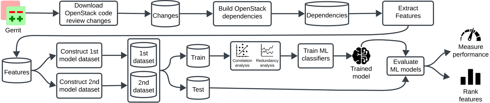

# This is the replication package of the paper **An ML-based Approach to Predicting Software Change Dependencies**

This project contains scripts, data, and results for studying and predicting dependent changes.

## An overview of the evaluation design

## How to run different scripts?

To reproduce the data, follow the steps described below where each step is indicated within the evaluation design.

1. **Download data:** Run the `download-data.py` script to collect code review changes from Gerrit.
2. **Transform data:** Run the `transform-data.py` script to transform the collcted JSON data to CSV files.
3. **Build dependencies data:** Run the `build-dependencies.py` script to generate dependencies among OpenStack's software changes.
4. **Build metrics for the 1st model:** Run the `build-metrics.py` script to build metrics of the 1st model.
5. **Build pairs:** Run the `build-metrics.py` script to build pairs of dependent changes.
6. **Build metrics for the 2nd model:** Run the `build-metrics-model2.py` script to build metrics of the 2nd model.

## How to reproduce the results

We explain provide all the notebooks used to report the results in the paper.

- **Preliminary study results:** Execute the `preliminary_study.ipynb` notebook to generate the preliminary study results.
- **Evaluation results of the 1st model:** Execute the `run_model1.ipynb` notebook to generate the evaluation results of the 1st model.
- **Evaluation results of the 2nd model:** Execute the `run_model2.ipynb` notebook to generate the evaluation results of the 2nd model.
- **Statistical tests:** Execute the `stats_test.ipynb` notebook to generate the statistical tests for different observations in the paper.
